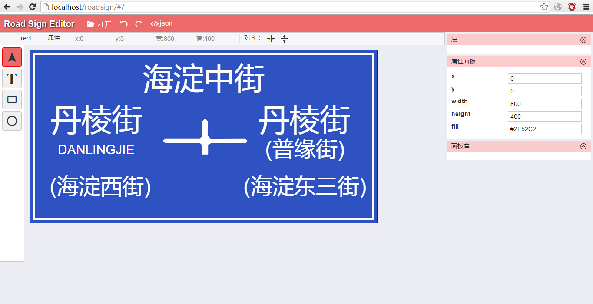

# roadsign
road sign svg editor

###道理标志牌编辑器

##道路标志牌json数据协议

##json格式如下

	{
		"type":  "P01",
		"texts": [
			{
				"text": "南京路",
				"x": 54,
				"y": 10，
				"size": 2
			}，
			{
				"text": "前方500m",
				"x": 100,
				"y": 80,
				"size": 1
			}
		],
		"signs"	[
			{
				"type": "A01",
				"x": 120,
				"y": 60,
			}，
			{
				"type": "G02",
				"x": 120,
				"y": 60,
				"road": "G2"
			}
		]
	}

type："P01"：蓝色底；"P02"：绿色底
texts：文字项数组
signs：标志项数组

文字项
text：文字；
x：坐标x
y：坐标y
size：尺寸

标志项
type：标志分类
x：坐标x
y：坐标y
其他标志属性项

##标志分类及数据格式

+ 标志是指牌中的图形部分，不包括文字和底框
+ 标志在牌中的位置是固定的，所以不需要提供位置坐标。

**指路标志**

>+  A01： 十字
  

	{
		"type": "A01"
	}

----------
 
>+ A02：T字交叉
>

	{
		"type": "A02"
	}

----------
 >+ A03：
 >
 
	{
		"type": "A03"
	}

>+ A04：
>

	{
		"type": "A04"
	}

----------

 >+ A05:：
 >

	{
		"type": "A05"
	}

----------

>+ A06：
>

	{
		"type": "A06"
	}

----------
 
>+ A07：左中右箭头
  

	{
		"type": "A07"
	}

---
>+ A08： 左右箭头
>

	{
		"type": "A08"
	}

----------
>+ A09：  环行交叉路口
>

	{
		"type": "A09"
	}

----------
>+ A10：  公路编号环行交叉路口
>

	{
		"type": "A10",
		"leftRoad": "S212",
		"rightRoad": "S213"
	}

----------
>+ A11：  公路编号十字交叉
>

	{
		"type": "A11",
		"leftRoad": "G108",
		"rightRoad": "G108"
	}

----------
>+ A12：  公路编号十字交叉
>

	{
		"type": "A12"
	}

----------
>+ A13:  环行交叉路口
>

	{
		"type": "A13"
	}

----------
>+ A14:  交通路口预告
>

	{
		"type": "A14"
	}

----------

>+ A15:  互通式立交
>

	{
		"type": "A15"
	}

----------
>+ A16:  互通式立交
>

	{
		"type": "A16"
	}

----------
 
 >+ A17: 互通式立交
 >

	{
		"type": "A17"
	}

----------

>+ A18:  Y型交叉路口
>

	{
		"type": "A18"
	}

----------

>+ A19:  分叉处
>

	{
		"type": "A19"
	}

**方向标志**

>+ B01:  东
>

	{
		"type": "B01"
	}

>+ B02：南
>

	{
		"type": "B02"
	}

>+ B03：西
>

	{
		"type": "B03"
	}

>+ B04：北
>

	{
		"type": "B04"
	}

----------

**其他标志**

>+ Z01:  道路编号标志
>

	{
		"type": "Z01"
	}

